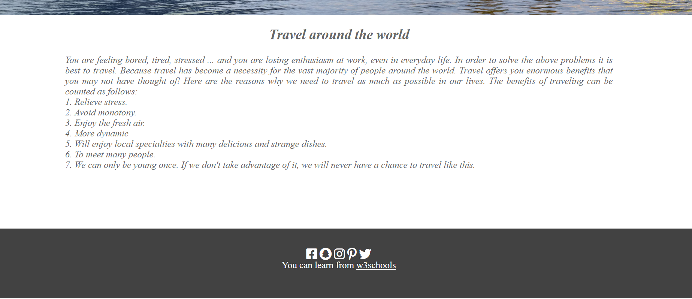
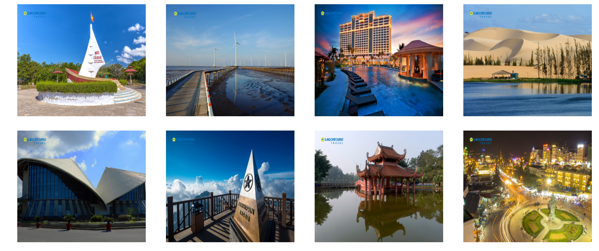
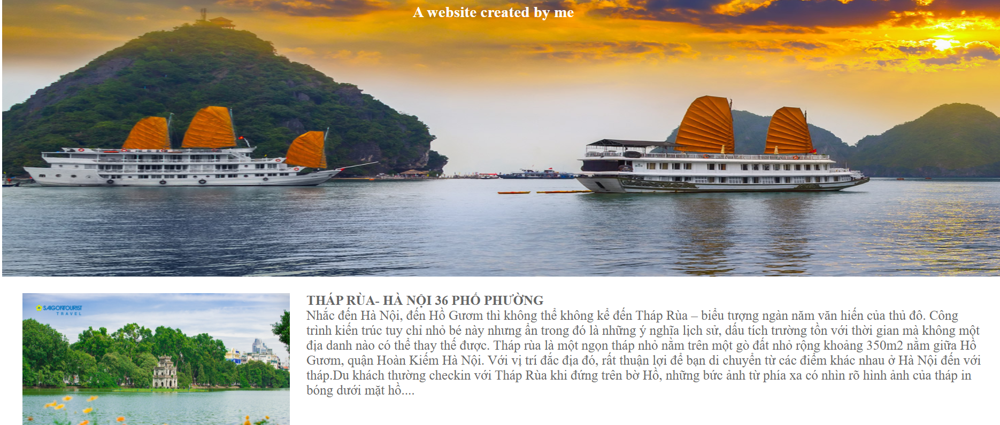
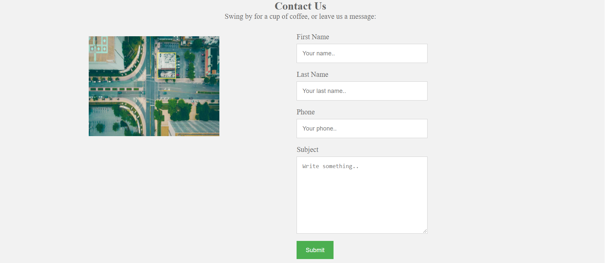
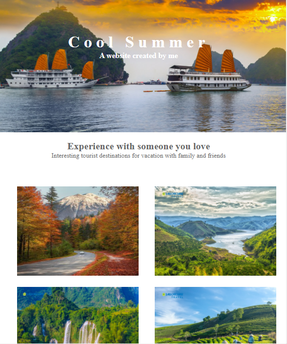
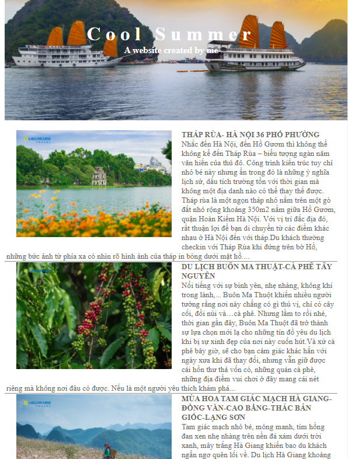

# Thiết kế website
## Coll Summer: trang web giới thiệu các địa điểm du lịch nổi tiếng ở Việt Nam , thích hợp cho gia đình, bạn bè thư giãn vào những ngày nghỉ
## Nội dung trang web gồm các phần: Header, Home(Lời tựa đầu ), Picture(các địa điểm du lịch nổi tiếng), Video (giới thiệu các địa điểm nổi tiếng ),Posts(bài viết) và trang connect(liên hệ)
# Kết quả :
### Trang web chế đô max:
- [x] Header:

- [x] Home:

- [x] Picture:

- [x] Video:

- [x] Posts:

- [x] Contact:

- [x] Footer:

### Trang web ở chế độ min
- [x] Home:
- [x] Picture:

- [x] Video:

- [x] Post:

- [x] Contact:

- [x]:

